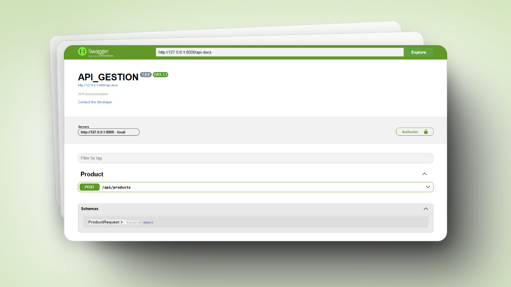

> [!WARNING]  
> Proyecto en desarrollo, aún en construcción.


# Laravel Auto-Generate Swagger API Documentation

Este es un paquete que busca facilitar la generación de documentación de API's en Laravel, utilizando Swagger UI.
La documentación se genera automáticamente a partir de la sintaxis de laravel.

## Indice

- [Laravel Auto-Generate Swagger API Documentation](#laravel-auto-generate-swagger-api-documentation)
  - [Indice](#indice)
  - [Requisitos](#requisitos)
  - [Instalación](#instalación)
  - [Uso](#uso)
  - [Configuración](#configuración)
  - [Ejemplos](#ejemplos)
  - [Atributos](#atributos)
  - [Temas](#temas)
  - [Referencias](#referencias)
  - [Licencia](#licencia)
  - [Contacto](#contacto)

## Requisitos

- 
- 

## Instalación

Configurar el archivo `composer.json` para que pueda leer el repositorio de GitHub.

```json

"repositories": [
    {
        "type": "vcs",
        "url": "https://github.com/epmyas2022/laravel-swagger.git"
    }
],
```

Agregar tambien

```json
    "require": {
        "laravel/swagger": "^0.3.0"
    }
```

Ejecutar el comando `composer update` para instalar el paquete.

## Uso

Es necesario publicar los archivos de configuracion y assets del paquete, para ello ejecutar el comando:

```bash
php artisan vendor:publish --provider "Laravel\Swagger\SwaggerServiceProvider"
```

Este comando creará un archivo de configuración en la carpeta `config` y una carpeta `swagger` en la carpeta `public`.

## Configuración

Agregar el provider service en el archivo `config/app.php`

```php
'providers' => [
    ...
    Laravel\Swagger\SwaggerServiceProvider::class,
    ...
]
```

Ahora ya podemos acceder a la documentación de la API en la ruta `/docs`.

## Ejemplos

**NOTA:** *para que la documentacion genere correctamente es necesario tipar los tipos de datos de esta manera la libreria puede inferir los tipos de datos.*

En este caso se ha creado un controlador llamado `ExampleController` con un método `index` que retorna un JSON,
y solo bastaria con agregar el atributo `#[SwaggerSection('Example')]` para que se genere la documentación.

```php
#[SwaggerSection('Example')]
class ExampleController extends Controller
{

    function index(): JsonResponse
    {
        return response()->json([
            'message' => 'Hello World'
        ]);
    }

}
```

```php
#[SwaggerSection('Example')]
class ExampleController extends Controller
{

    function store(ExampleRequest $request): JsonResponse
    {
        return response()->json([
            'data' => $request->validated(),
        ]);
    }

}

```

Los parametros de ruta se detectan automaticamente al agregarlos al metodo.

```php
#[SwaggerSection('Example')]
class ExampleController extends Controller
{

    function update(ExampleRequest $request, int $id): JsonResponse
    {
        return response()->json([
            'data' => $request->validated(),
            'id' => $id,
        ]);
    }

}   
```

```php
#[SwaggerSection('Example')]
class ExampleController extends Controller
{

    function destroy(string $id): JsonResponse
    {
        return response()->json(['id' => $id]);
    }

}
```

## Atributos

Existen distintos atributos que se pueden agregar a los métodos y clases para personalizar la documentación.

| Atributo | Descripción |
| --- | --- |
| `#[SwaggerSection('Example')]` | Agrega una sección a la documentación (se coloca arriba de la clase) |
| `#[SwaggerContent('application/json')]` | Agregar el tipo contenido en el cuerpo (se coloca arriba del metodo)|
| `#[SwaggerResponse(['message' => 'hello'])]` | Agregar una respuesta personalizada (se coloca arriba del metodo)|
| `#[SwaggerSummary('descripcion')]` | Agrega una descripcion al endpoint (se coloca arriba del metodo)|
| `#[SwaggerAuth('bearerToken')]` | Agrega un tipo de autenticacion especifica para una ruta (se coloca arriba del metodo)|
| `#[SwaggeResponseFile]` | Agrega una respuesta de archivo (se coloca arriba del metodo)|
| `#[SwaggerGlobal(['security' => 'bearerToken', 'middleware' => 'auth'])]` | Atributos globales afectan a todas las rutas (se coloca arriba de una clase de preferencia en Controller)|

## Temas

Se pueden personalizar los temas de la documentación, para ello se debe modificar el archivo `config/swagger.php`.

```php
return [
 'options' => [
        'theme' => ThemeSwagger::X_CODE_LIGHT,
    ],
]
```

Los temas disponibles son:

- `ThemeSwagger::X_CODE_LIGHT`
- `ThemeSwagger::DRACULA`
- `ThemeSwagger::MONOKAI`
- `ThemeSwagger::NORD`
- `ThemeSwagger::SEPIA`
- `ThemeSwagger::ONE_DARK`
- `ThemeSwagger::UNIVERSAL_DARK`
- `ThemeSwagger::SELOREX_SWAGGER`



## Referencias

- [Swagger](https://swagger.io/)
- [Swagger UI](https://swagger.io/tools/swagger-ui/)

## Licencia

Este proyecto está bajo la licencia MIT. Consulte el archivo [LICENSE](LICENSE) para obtener más información.

## Contacto

- [Gmail](mailto:castillo20182017@gmail.com)
- [Linkedin](https://www.linkedin.com/in/isaac-castillo-b4a213225/)
